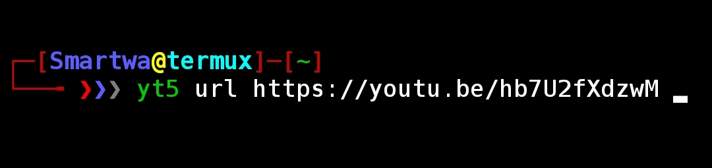
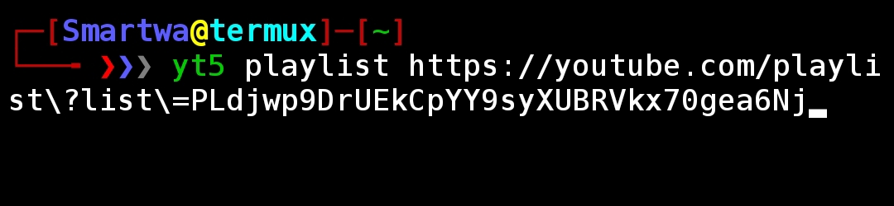
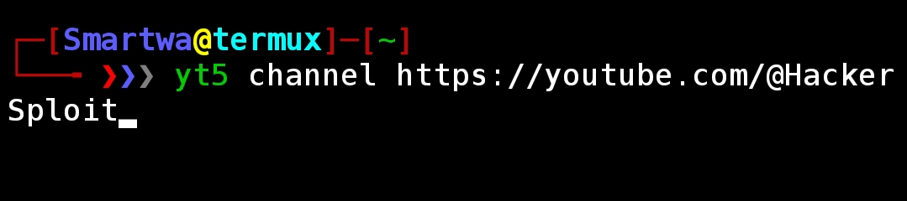

# yt5 #

```
                                                                   
                                                                   
                                  tttt          555555555555555555 
                               ttt:::t          5::::::::::::::::5 
                               t:::::t          5::::::::::::::::5 
                               t:::::t          5:::::555555555555 
yyyyyyy           yyyyyyyttttttt:::::ttttttt    5:::::5            
 y:::::y         y:::::y t:::::::::::::::::t    5:::::5            
  y:::::y       y:::::y  t:::::::::::::::::t    5:::::5555555555   
   y:::::y     y:::::y   tttttt:::::::tttttt    5:::::::::::::::5  
    y:::::y   y:::::y          t:::::t          555555555555:::::5 
     y:::::y y:::::y           t:::::t                      5:::::5
      y:::::y:::::y            t:::::t                      5:::::5
       y:::::::::y             t:::::t    tttttt5555555     5:::::5
        y:::::::y              t::::::tttt:::::t5::::::55555::::::5
         y:::::y               tt::::::::::::::t 55:::::::::::::55 
        y:::::y                  tt:::::::::::tt   55:::::::::55   
       y:::::y                     ttttttttttt       555555555     
      y:::::y                                                      
     y:::::y                                                       
    y:::::y                                                        
   y:::::y                                                         
  yyyyyyy                                                          
                                                                   
                                                                   
```
- **yt5** is a [Python](https://python.org) script that downloads [YouTube](https://www.youtube.com) ***Videos*** & ***audios*** at `console` environment.

## Installation ##
- Run the following commands in the terminal to get started.

```
$ git clone https://github.com/Simatwa/yt5.git
$ cd yt5
$ bash setup.sh

```


## Usage ##

1. Video

- Videos can be downloaded by parsing a `URI` <sup>prefixed</sup> or <sub>postfixed</sub> by its category:
- For instances:
1. Single video :

```
$ yt5 url <Video-URI>

```		

     
- Alternatively, this can be done by emitting `url` command since it's the default category.

```
$ yt5 <Video-URI>

```


2. All videos in a Playlist :

```
$ yt5 playlist <Playlist-URI>

```

	 
3. All videos in a Channel : 

```
$ yt5 channel <Channel-URI>

```

		
4. Collection of single-video's URI contained in a text file : 

```
$ yt5 fnm <file-path>

```

			
2. Audio

- Audio of a video can be downloaded by adding `---mp3` to the commands parsed.
  - For instance:
1. Single audio : 
  		
```
$ yt5 url <Video-URI>  --mp3

```


       
- Similarly, this can be done to **other** ***categories***.

- For further information you can run:
	
```
$ yt5 -h

```  


## Independencies ##

1. [pytube](https://github.com/pytube/pytube)
2. [colorama](https://github.com/pytube/pytube)
3. [tabulate](https://github.com/astanin/python-tabulate)
 
 * [Review](requirements.txt).


## Acknowledgements ##

- [x] [Pytube](https://github.com/pytube/pytube)
- [x] [Python Team](https://python.org)